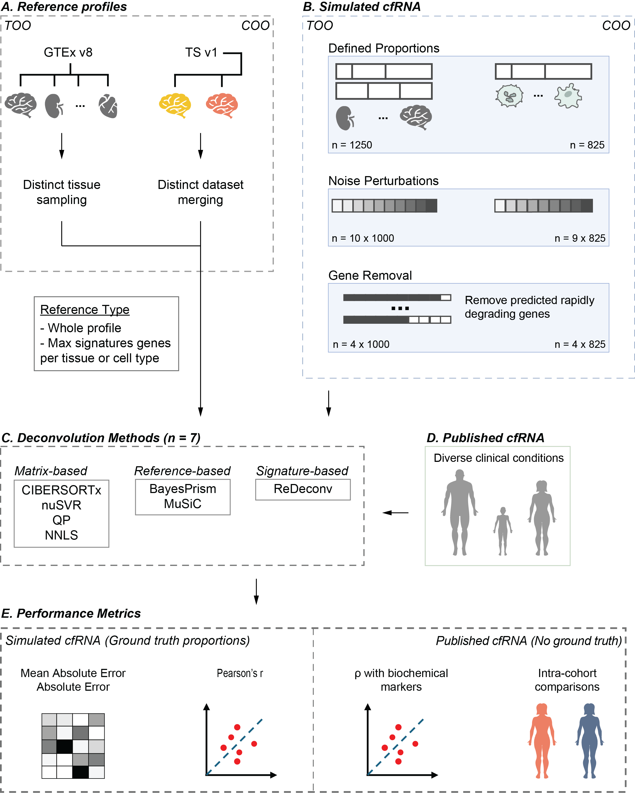

# Benchmarking tissue- and cell-type-of-origin deconvolution in cell-free transcriptomics

**Ioannou A**1, **Friman ET**1, **Daub CO**3,4, **Bickmore WA**1*, **Biddie SC**1,2*

1 MRC Human Genetics Unit, Institute of Genetics and Cancer, University of Edinburgh, Edinburgh, United Kingdom  
2 Department of Critical Care, Royal Infirmary of Edinburgh, NHS Lothian, Edinburgh, United Kingdom  
3 Department of Medicine Huddinge, Karolinska Institutet, Huddinge, Sweden  
4 Science for Life Laboratory, Solna, Sweden  

---

## Abstract

Plasma cell-free RNA (cfRNA) reflects tissue- and cell-type-specific activity across pathological states and is a promising biomarker for organ injury and disease. Computational deconvolution methods are widely used to infer organ and cell-type contributions to cfRNA profiles. However, most were originally developed for single-tissue bulk transcriptomes and their performance in body-wide cfRNA settings, where any tissue or cell type can contribute, remains poorly characterised. Here, we present a systematic benchmarking of tissue- and cell type-of-origin deconvolution for plasma cfRNA that considers both methodological and reference-related sources of variability under realistic cfRNA simulation settings. We evaluated seven commonly used deconvolution methods across distinct algorithmic classes and multi-organ reference configurations derived from bulk and single-cell atlases. We assessed performance using simulation frameworks that model multi-organ mixtures, technical noise, and transcript degradation. We further examined deconvolution methods across multiple previously published clinical cfRNA cohorts spanning diverse disease contexts. Across both tissue- and cell-type-level analyses, deconvolution performance was strongly influenced by both method choice and reference parameters. Tissue-of-origin inference was comparatively robust across simulated and clinical datasets, recovering disease-associated organ signals and concordance with biochemical markers. In contrast, cell type-of-origin inference showed greater variability and reduced consistency across analytical settings, leading to divergent interpretations in both simulations and published clinical cfRNA cohorts. Together, these findings demonstrate that methodological and reference-related variability are major sources of uncertainty in cfRNA deconvolution, with tissue-level inference being more robust than cell-type-level inference. Our benchmarking framework provides guidance for reference selection and comparative interpretation in cfRNA deconvolution.

---

## Study overview

**Figure 1.** Overview of the benchmarking framework.

---

## Methods

### Table 1: Description of the deconvolution methods assessed in this study

| Method | Reference input | Tool type | Algorithmic framework | Source |
|---|---|---|---|---|
| NuSVR (inspired by AutoGeneS) | CIBERSORTx-based reference matrix generated from reference tissue or cell-type data | Custom | Machine learning (SVR-based regression) | Vorperian et al., 2022 |
| Quadratic programming (QP) | CIBERSORTx-based reference matrix generated from reference tissue or cell-type data | Custom | Constrained optimisation | Vorperian et al., 2022 |
| Non-negative least squares (NNLS) | CIBERSORTx-based reference matrix generated from reference tissue or cell-type data | Custom | Linear regression | Vorperian et al., 2022 |
| CIBERSORTx | CIBERSORTx-based reference matrix generated from reference tissue or cell-type data | Published | Machine learning (SVR-based regression) | Newman et al., 2019 |
| MuSiC | Gene profiles of cell types or tissues with sample metadata | Published | Weighted linear regression | Wang et al., 2019 |
| BayesPrism | Gene profiles of cell types or tissues | Published | Bayesian model | Chu et al., 2022 |
| ReDeconv | Gene profiles of cell types or tissues with sample metadata | Published | Probabilistic variance-aware model | Lu et al., 2025 |

**References (Table 1):**  
- Vorperian, S. K., Moufarrej, M. N. & Quake, S. R. Cell types of origin of the cell-free transcriptome. Nat Biotechnol 40, 855–861 (2022).
- Newman, A. M. et al. Determining cell type abundance and expression from bulk tissues with digital cytometry. Nat Biotechnol 37, 773–782 (2019).
- Wang, X., Park, J., Susztak, K., Zhang, N. R. & Li, M. Bulk tissue cell type deconvolution with multi-subject single-cell expression reference. Nat Commun 10, 380 (2019).
- Chu, T., Wang, Z., Pe’er, D. & Danko, C. G. Cell type and gene expression deconvolution with BayesPrism enables Bayesian integrative analysis across bulk and single-cell RNA sequencing in oncology. Nat Cancer 3, 505–517 (2022).
- Lu, S. et al. Transcriptome size matters for single-cell RNA-seq normalization and bulk deconvolution. Nat Commun 16, 1246 (2025).

---

## Data

### Table 2: Bulk and single-cell RNA sequencing data used as reference profiles and simulated mixtures in the TOO and COO deconvolution of this study

| Dataset | Description | Purpose |
|---|---|---|
| GTEx v8 | Gene-level RNA-seq read counts from bulk human tissues | Construction of tissue reference profiles |
| SRP163252 | Bulk RNA-seq atlas of normal human tissues | Generation of simulated tissue mixtures |
| Tabula Sapiens V1 | Multi-organ human single-cell RNA-seq atlas | Basis for augmented cell-type reference construction |
| Darmanis Brain | Human brain single-cell RNA-seq dataset | Augmentation of Tabula Sapiens reference (TSP-BDa inner and outer merges) |
| Human Brain Atlas | Human brain single-nucleus RNA-seq atlas | Augmentation of Tabula Sapiens reference (TSP-HBA inner merge) |
| Tabula Sapiens V2 | Multi-organ human single-cell RNA-seq atlas | Generation of simulated cell-type mixtures |

**References (Table 2):**  
- The GTEx Consortium. The GTEx Consortium atlas of genetic regulatory effects across human tissues. Science 369, 1318–1330 (2020).
- Suntsova, M. et al. Atlas of RNA sequencing profiles for normal human tissues. Sci Data 6, 36 (2019).
-	The Tabula Sapiens Consortium. The Tabula Sapiens: A multiple-organ, single-cell transcriptomic atlas of humans. Science 376, eabl4896 (2022).
- Darmanis, S. et al. A survey of human brain transcriptome diversity at the single cell level. Proc. Natl Acad. Sci. USA 112, 7285–7290 (2015).
- Siletti, K. et al. Transcriptomic diversity of cell types across the adult human brain. Science 382, eadd7046 (2023).
- The Tabula Sapiens Consortium & Quake, S. R. Tabula Sapiens reveals transcription factor expression, senescence effects, and sex-specific features in cell types from 28 human organs and tissues. 2024.12.03.626516 Preprint at https://doi.org/10.1101/2024.12.03.626516 (2025).

### Table 3: Published cfRNA datasets of different cohorts used in the TOO and COO deconvolution of this study

| Study | Accession | Pathology / Cohort Description |
|---|---|---|
| Loy et al., 2024 | GSE255555 | Paediatric inflammatory syndromes |
| Chalasani et al., 2021 | PRJNA701722 | NAFLD, NASH, and healthy controls |
| Toden et al., 2020 | PRJNA574438 | Alzheimer’s disease patients and controls |
| Loy et al., 2023 | GSE225223 | Children with COVID-19, MIS-C, and controls |
| Moufarrej et al., 2022 | GSE192902 | Pre-eclamptic pregnancies and normotensive controls |

**References (Table 3):**  
- Loy, C. J. et al. Plasma cell-free RNA signatures of inflammatory syndromes in children. Proc. Natl Acad. Sci. USA 121, e2403897121 (2024).
- Chalasani, N. et al. Noninvasive stratification of nonalcoholic fatty liver disease by whole transcriptome cell-free mRNA characterization. Am J Physiol Gastrointest Liver Physiol 320, G439–G449 (2021).
- Toden, S. et al. Noninvasive characterization of Alzheimer’s disease by circulating, cell-free messenger RNA next-generation sequencing. Sci Adv 6, eabb1654 (2020).
- Loy, C. J. et al. Nucleic acid biomarkers of immune response and cell and tissue damage in children with COVID-19 and MIS-C. Cell Rep Med 4, 101034 (2023).
-	Moufarrej, M. N. et al. Early prediction of preeclampsia in pregnancy with cell-free RNA. Nature 602, 689–694 (2022).

---

## Repository Structure

This repository is organised by analysis theme and deconvolution scenario.  
Directories are grouped into **TOO (Tissue-of-Origin)** and **COO (Cell-of-Origin)** workflows, with subdivisions for simulated data, published datasets, degradation experiments, and noise analyses.

### Top-level layout

- **TOO-Matrix/**  
  Builds, stores, and harmonises gene names in tissue reference matrices, including CIBERSORTx-generated matrices and variants used by BayesPrism, MuSiC, and ReDeconv. Precomputed matrices are provided for direct reuse.

- **COO-Matrix/**  
  Builds and stores cell-type reference inputs derived from Tabula Sapiens and brain atlas augmentations (TSP-BDa inner/outer and TSP-HBA inner). Precomputed reference matrices are provided in compressed (`.txt.gz`) format for direct reuse.  
  These include matrices used for CIBERSORTx as well as variants formatted for BayesPrism, MuSiC, and ReDeconv.

- **TOO-Decon/**  
  Benchmarking of TOO deconvolution on simulated tissue mixtures (random and uniform proportions), including generation of performance metrics and plots.

- **TOO-Decon-Noise/** 
  Construction of noise-perturbed tissue mixtures with random proportions for TOO deconvolution, followed by deconvolution and generation of performance metrics and plots.

- **TOO-Decon-Degradation/** 
  Removal of rapidly degrading genes from simulated tissue mixtures with random proportions, followed by TOO deconvolution and generation of performance metrics and plots.

- **COO-Decon-Pseudobulks/**  
  Benchmarking of COO deconvolution on simulated pseudo-bulk mixtures with random proportions, including generation of performance metrics and plots.

- **COO-Decon-KnownTissue/**  
  Benchmarking of COO deconvolution on bulk brain tissue samples from GTEx, including generation of performance metrics and plots.

- **COO-Decon-Noise/**  
  Noise sensitivity analyses for COO scenarios, including generation of performance metrics and plots.

- **COO-Decon-Degradation/**  
  Removal of rapidly degrading genes from pseudo-bulk with random proportions, applies them to COO deconvolution and generation of performance metrics and plots.

- **TOO-Decon-Published/** and **COO-Decon-Published/**  
  Application of TOO/COO deconvolution methods to published cfRNA datasets.  
  Each study is stored in a dedicated subfolder (e.g. `Chalasani_Fatty-Liver/`, `Loy_COVID-MIS-C/`, `Moufarrej_Pre-Eclampsia/`, `Toden_AD/`).

- **Raw-Published/**  
  Scripts for retrieving, processing, or quantifying published cfRNA data (e.g. download, trimming, mapping, deduplication, QC filtering, quantification, patient selection).

- **COO-Simulated/** and **TOO-Raw-Simulated/**  
  Components used to generate simulation inputs:
  - `COO-Simulated/` contains AnnData preprocessing/QC and pseudo-bulk mixture generation.
  - `TOO-Raw-Simulated/` contains scripts for retrieving and mapping raw simulated tissue data used to build simulated tissue mixtures for TOO deconvolution.

- **GTEx-Degradation-Comparison-cfRNA-Studies/**  
  Analyses comparing degradation rates and expression using GTEx and cfRNA studies.

### Matrix Selection Strategy
Noise, degradation, and published-data workflows use **best-performing reference matrices per method**, selected based on prior optimisation using simulated benchmarking experiments:

- `TOO-Decon-Noise/`
- `TOO-Decon-Degradation/`
- `COO-Decon-Noise/`
- `COO-Decon-Degradation/`
- `TOO-Decon-Published/`
- `COO-Decon-Published/`

### Common file naming conventions

Across deconvolution scenario folders (e.g., `TOO-Decon/`, `COO-Decon-Noise/`, `COO-Decon-Published/<study>/`), scripts are typically ordered by prefix:

- `00_...` : preprocessing / formatting / input construction (including matrix and mixture scaling steps)
- `01_...` : running deconvolution methods (BayesPrism, MuSiC, CIBERSORTx, NNLS, QP, NuSVR, ReDeconv)
- `02_...` : evaluation, metrics calculation, plotting (e.g., Pearson/MAE heatmaps, spillover, summary CSVs)
- `03_...` : downstream comparisons (e.g., metadata association analyses)

NuSVR-related workflows sometimes include dedicated subfolders (e.g., `NuSVR-Scripts/` or dated script sets) to manage multiple parameter sweeps and reruns.

Scripts are intended to be run sequentially (00 → 01 → 02 → 03).

### Quick Start Guide

- For **TOO benchmarking on simulated data**: start in `TOO-Decon/`  
- For **COO benchmarking on pseudo-bulks**: start in `COO-Decon-Pseudobulks/`  
- For **published cfRNA analyses**: start in `TOO-Decon-Published/` and `COO-Decon-Published/`  
- For **building reference inputs**: see `TOO-Matrix/` and `COO-Matrix/`

---

## Reproducibility 

Intermediate files for deconvolution scenarios are included selectively where available.
When provided, these files enable regeneration of the figures without path issues.